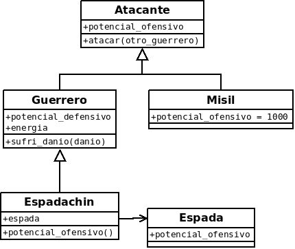
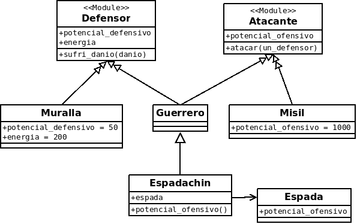

# Clase 1 TADP 1C2016

## Aspectos administrativos:

- Se van a usar 2 lenguajes (Ruby y Scala)

- Van a haber 2 TPs(uno de metaprogramación y el otro de híbrido objetos-funcional), cada uno con una entrega grupal y una individual. Tienen que darnos una hoja por grupo con legajo, nombre, apellido y email.

- Página de la materia: [http://tadp-utn-frba.github.io/](http://tadp-utn-frba.github.io/)

- Es muy importante que se anoten a la lista de emails de la cursada: [https://groups.google.com/forum/#!forum/tadp-cursada](https://groups.google.com/forum/#!forum/tadp-cursada)

- La idea es hacer una evaluación a lo largo de todo el año. El final no es que no se toma, sino que se evalúa a lo largo de la cursada.

## Repaso Objetos

Vamos a comenzar pensando un juego de estrategia, similar al Age of Empires. En este juego existen guerreros que pueden atacarse entre sí. Cada Guerrero tiene un potencial ofensivo y un potencial defensivo y una cantidad de energía. Cuando un guerrero ataca a otro compara el potencial ofensivo suyo contra el potencial defensivo del otro. Si el potencial ofensivo del atacante es mayor o igual al del defensor, entonces el defensor resta la diferencia entre ambos en energía.

¿Cómo podemos programar esto con objetos?

* Lo más obvio es modelar a los guerreros como objetos, que sean instancias de la clase Guerrero y que tengan como variables de instancia potencial_ofensivo, potencial_defensivo y energia.

* Cada Guerrero entiende el mensaje atacar, que recibe por parámetro a otro guerrero y se implementa de la siguiente manera:

~~~ruby
class Guerrero
    attr_accessor :energia, :potencial_ofensivo, :potencial_defensivo

    def atacar(otro_guerrero)
        if(self.potencial_ofensivo >= otro_guerrero.potencial_defensivo)
            danio = self.potencial_ofensivo - otro_guerrero.potencial_defensivo
            otro_guerrero.sufri_danio(danio)
        end
    end

    def sufri_danio(danio)
        self.energia= self.energia - danio
    end
end
~~~

Sobre los detalles de la implementación de Ruby no las trataremos con mucho detalle en clase, pero en este script podemos dedicarle algunas líneas a explicar brevemente un poco sobre su sintaxis.

En Ruby vemos que para declarar una clase se lo hace mediante Class x …. end. En este lenguaje veremos que en vez de que haya curly braces o indentación para delimitar el contexto de una clase, método, etc., en Ruby se lo hace mediante end para finalizar el scope y ni bien se define una estructura su contexto empieza desde ahí.

Otro tema es la sentencia attr_accesor, por ahora solamente lo que nos interesa es que nos permite definir los accessors (getter y setter) para una variable de instancia. El nombre de las variables de instancia no se definen como strings sino con un : antes del identificador. Esto es porque lo que sea la sintaxis :<lo que sea> se lo conoce como símbolo en Ruby, esto es simplemente un string, no es un objeto o una clase. La propiedad que lo diferencia es que es inmutable, no se pueden hacer declaraciones del tipo

~~~ruby
:algo = ‘algo mas’
~~~

Pero si se pueden hacer asignaciones o comparaciones usando símbolos.

~~~ruby
	A = :bleh

	A == :bleh
~~~

Para más información sobre símbolos en Ruby ver: [http://rubylearning.com/blog/2007/11/26/akitaonrails-on-ruby-symbols/](http://rubylearning.com/blog/2007/11/26/akitaonrails-on-ruby-symbols/)

Volviendo al modelo y al problema del Age of Empires:

* Marcamos una diferencia entre el mensaje sufri_danio y los demás, este es el único que tiene **efecto**. 

* Todo eso nos permitió repasar los conceptos de objeto, clase, instancia, mensaje, método, atributo, accessors, efecto.

Ahora agregamos un caso especial de Guerrero: los espadachines, que se parecen mucho a los guerreros, pero su potencial ofensivo se ve incrementado por el uso de una espada. Para modelar esto agregamos dos clases Espadachin y Espada.

* Espadachin es una subclase de Guerrero, que agrega la variable de instancia espada.

* Espada es una nueva clase, que define el método potencial_ofensivo.

En Espadachin redefinimos el método potencial_ofensivo de la siguiente manera:

~~~ruby

class Espada
    attr_accessor :potencial_ofensivo
end

class Espadachin < Guerrero
    attr_accessor :espada

    def potencial_ofensivo
        self.espada.potencial_ofensivo * super.potencial_ofensivo
    end
end
~~~

Luego agregamos Misiles, que pueden atacar pero no tiene sentido que se defiendan. Se nos ocurrió hacer una superclase Atacante, que sea superclase entre Misil y Guerrero. Movimos el atacar a la superclase. La clase Atacante no va a tener instancias, a este tipo de clases las denominamos **clases abstractas**.

Los misiles tienen un potencial ofensivo fijo de 1000, por lo tanto esa implementación no será compartida con los demás Atacantes. Si bien observamos que no es necesario, vemos que puede ser piola definir el método abstracto potencial_ofensivo en Atacante, para explicitar que las subclases deberían proveer una implementación de este método. A este tipo de métodos los llamamos **métodos abstractos**. 

## Mixins

Finalmente, agregamos Murallas, que pueden defenderse, pero no atacar. Acá llegamos a un punto crítico en términos de diseño, porque la herencia simple no nos permite modelar esto de forma elegante. O sea no podemos extender una clase abstracta de otra, ya que si por ejemplo tenemos una clase que defina solamente el comportamiento y estado de defensor, que es energía y sufri_danio, y que esta extienda de atacante, la muralla aún tendrá el comportamiento heredado de atacante. Lo mismo sucede si invertimos el orden, en ese caso, los misiles podrán tener el comportamiento de defensor. Una solución es la de usar herencia múltiple, solo que muy pocos lenguajes lo soportan (C++ por ejemplo), e introduce varios problemas de resolución de conflixtos como el del problema del rombo o diamante ([https://en.wikipedia.org/wiki/Multiple_inheritance#The_diamond_problem](https://en.wikipedia.org/wiki/Multiple_inheritance#The_diamond_problem)). Entonces si solo disponemos de herencia simple en Ruby como resolvemos esto?  

Para solucionar esto incorporamos una herramienta nueva: los Mixins.

Un mixin es similar a una clase, en el sentido de que permite definir un conjunto de métodos dentro de él, pero con la diferencia de que, en lugar de ser instanciable, otras clases pueden incorporarlos como parte de sus métodos (otro enfoque sería pensar en los mixins como interfaces con código). En este caso podemos definir Defensor como un mixin, que provee el método #sufri_danio:.

Para crear el Mixin debemos escribir, en el lugar donde normalmente definimos las clases:

~~~ruby

module Atacante
    def atacar(un_defensor)
        ...
    end
end

~~~

Ante la aparición de los mixins, podemos estar tentados de usarlos también para definir a los Atacantes. Entonces borramos la clase Atacante y creamos el Mixin, que define el método #atacar:. 

Usando los mixins la clase Guerrero puede implementarse de la siguiente manera:

~~~ruby

class Guerrero
    include Defensor
    include Atacante
end

~~~

### Más cuestiones sobre mixins

* Los mixins permiten también definir estado.

* ¿Qué pasa cuando uso dos mixins que definen el mismo método? Se produce un conflicto y, a diferencia de otras herramientas, la idea de mixins es que el lenguaje define una forma de resolverlos automáticamente y el programador debe acomodarse.

* Otra característica esencial de los Mixins es el concepto de *linearization.*

Sobre esto no hablamos mucho, para profundizar más conviene leer en: 

### ¿Conviene poner todo el código en los Mixins?

Hay gente que opina que sí, porque son unidades más reutilizables que las clases, pero ese enfoque hace que el rol de la clase sea solamente implementar mixins e instanciarse… Otra idea es usar siempre clases, hasta que por motivos de diseño similares a los presentados sea indispensable utilizar mixins. En general, el mejor enfoque suele estar en algún lugar del medio, aplicando una herramienta u otra aplicando criterio.

Código de la clase:

[https://github.com/uqbar-paco/tadp-ruby-age-of-empires/tree/introMixins](https://github.com/uqbar-paco/tadp-ruby-age-of-empires/tree/introMixins)

### Para la clase que viene:

Leer el paper donde se presenta la idea de Mixins:

[http://www.bracha.org/oopsla90.pdf](http://www.bracha.org/oopsla90.pdf)

Leer la idea de Traits:

[http://scg.unibe.ch/archive/papers/Scha03aTraits.pdf](http://scg.unibe.ch/archive/papers/Scha03aTraits.pdf)

[http://scg.unibe.ch/archive/papers/Berg07aStatefulTraits.pdf](http://scg.unibe.ch/archive/papers/Berg07aStatefulTraits.pdf)

Hacer especial foco cómo se resuelven los conflictos, cómo se implementan variables y en la diferencia entre flattening y linearization (y que implican para el programador)
